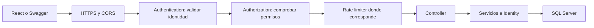
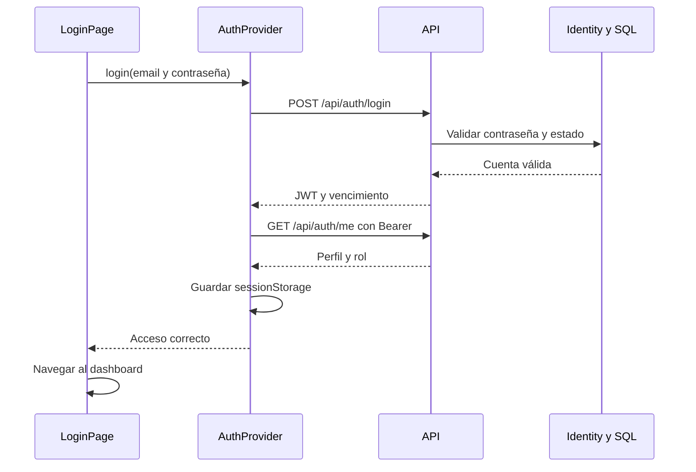

# DigitalArs — README explicado para aprender full stack

Este documento explica la autenticación, autorización, seed y conexión con React implementados en DigitalArs. El foco está en entender **qué hace cada parte y en qué archivo encontrarla**.

**Versión documentada:** entrega final con administrador inicial creado mediante el comando `--bootstrap-admin`. El formulario de primer administrador de una versión anterior ya no es parte del flujo vigente.

Las rutas del documento son relativas al repositorio. La carpeta del backend, el proyecto y los namespaces usan todos el mismo nombre: **DigitalArs.Api**.

## Índice

1. [Qué se implementó](#1-qué-se-implementó)
2. [Conceptos básicos](#2-conceptos-básicos)
3. [Mapa de archivos](#3-mapa-de-archivos)
4. [Program.cs y arranque](#4-programcs-y-arranque)
5. [Database First e Identity](#5-database-first-e-identity)
6. [DTOs y validaciones](#6-dtos-y-validaciones)
7. [Registro](#7-registro)
8. [Login](#8-login)
9. [JWT y permisos](#9-jwt-y-permisos)
10. [Invitaciones y usuarios desactivados](#10-invitaciones-y-usuarios-desactivados)
11. [Seed y administrador inicial](#11-seed-y-administrador-inicial)
12. [Secretos y configuración](#12-secretos-y-configuración)
13. [Endpoints](#13-endpoints)
14. [Frontend y contextos globales](#14-frontend-y-contextos-globales)
15. [Cómo iniciar el proyecto](#15-cómo-iniciar-el-proyecto)
16. [Pruebas y criterios de aceptación](#16-pruebas-y-criterios-de-aceptación)
17. [Errores frecuentes](#17-errores-frecuentes)
18. [Dónde modificar cada cosa](#18-dónde-modificar-cada-cosa)
19. [Alcance y pendientes](#19-alcance-y-pendientes)

## 1. Qué se implementó

El proyecto partía de un registro provisional y un login que devolvía un texto como token. CineApi se usó como referencia para JWT, pero sus usuarios y contraseñas estaban escritos en el código.

En DigitalArs se incorporaron:

- Registro real y persistencia de cuentas.
- Contraseñas hasheadas mediante ASP.NET Core Identity.
- Login que emite JWT y validación de esos tokens.
- Roles Usuario y Administrador.
- Endpoint de prueba de autenticación y consulta de sesión.
- Rechazo de usuarios desactivados.
- Alta administrativa sin contraseña e invitación para establecerla.
- Renovación de invitaciones y cambio de estado desde la API.
- Roles asegurados al arrancar y primer administrador creado con `--bootstrap-admin`.
- Estructura de Identity preparada con `--init-identity`; la clave JWT se configura a mano.
- Swagger con soporte Bearer y CORS para React.
- Login, registro, dashboard y alta de usuarios desde el frontend.
- Llamadas a la API centralizadas en AuthProvider.

La entrega implementa la base de acceso. No implementa toda la operatoria financiera de una billetera.

## 2. Conceptos básicos

| Concepto                  | Explicación                                                                      |
| ------------------------- | -------------------------------------------------------------------------------- |
| Frontend                  | Formularios, botones y navegación que ve el usuario.                             |
| Backend/API               | Recibe solicitudes, aplica reglas, comprueba permisos y accede a la base.        |
| Endpoint                  | Dirección y método HTTP, como POST /api/auth/login.                              |
| DTO                       | Define los datos que una operación acepta o devuelve.                            |
| Entidad                   | Clase que representa datos persistidos, como Usuario.                            |
| DbContext                 | Permite consultar y guardar datos mediante Entity Framework.                     |
| Identity                  | Biblioteca para cuentas, hashes de contraseña, roles y operaciones de seguridad. |
| JWT                       | Token firmado que el cliente presenta para identificarse.                        |
| Autenticación             | Comprobar quién hace la petición.                                                |
| Autorización              | Comprobar si puede realizar esa operación.                                       |
| Seed                      | Carga de registros iniciales necesarios.                                         |
| Transacción               | Agrupa cambios que se confirman juntos o se revierten.                           |
| Middleware                | Paso por el que atraviesa una petición antes de llegar al controlador.           |
| Inyección de dependencias | ASP.NET crea y entrega los servicios que necesita cada clase.                    |

Ejemplo: tener un JWT válido identifica a una persona; tener el rol Administrador permite que registre a otros usuarios mediante el endpoint administrativo.

## 3. Mapa de archivos

Dentro de **backend/DigitalArs.Api/**:

| Archivo                                    | Responsabilidad                                                      |
| ------------------------------------------ | -------------------------------------------------------------------- |
| Program.cs                                 | Configuración, arranque y recorrido de peticiones.                   |
| DigitalArs.Api.csproj                      | Versión de .NET, paquetes y recursos SQL incluidos en el ensamblado. |
| Controllers/AuthController.cs              | Registro, login, primera contraseña, sesión y prueba protegida.      |
| Controllers/UsuariosController.cs          | Crear usuarios con invitación, renovarla y cambiar estado.           |
| Controllers/SetupController.cs             | Estado del alta inicial y compatibilidad con el formulario retirado. |
| Controllers/TiposDeMovimientosController.cs | Catálogo de tipos de movimiento: listado y detalle por id.          |
| Controllers/CuentasController.cs           | Estructura vacía, todavía sin endpoints.                             |
| Controllers/MovimientosController.cs       | Estructura vacía, todavía sin endpoints.                             |
| Data/Context/DigitalArsDbContext.cs        | Modelo de las tablas del negocio.                                    |
| Data/Context/AuthDbContext.cs              | Modelo de las tablas Identity.                                       |
| Data/Entities/Usuario.cs                   | Perfil del usuario de negocio.                                       |
| Data/Entities/Cuenta.cs                    | Datos de una cuenta.                                                 |
| Data/Entities/Movimiento.cs                | Datos de un movimiento.                                              |
| Data/Entities/Tipo_Movimiento.cs           | Catálogo de tipos.                                                   |
| Data/Sql/001_Identity.sql                  | Creación de tablas Identity.                                         |
| DTOs/LoginDto.cs                           | Datos para ingresar.                                                 |
| DTOs/RegisterDto.cs                        | Datos para registrarse con contraseña.                               |
| DTOs/AuthRequests.cs                       | Perfil, primera contraseña, estado activo y respuesta JWT.           |
| DTOs/AuthResponses.cs                      | Respuestas de registro, de perfil y de mensaje simple.               |
| DTOs/UsuarioResponses.cs                   | Respuestas del alta de usuario y de la invitación.                   |
| DTOs/SetupStatusResponse.cs                | Respuesta del estado del alta inicial.                               |
| DTOs/TipoMovimientoResponse.cs             | Respuesta del catálogo de tipos de movimiento.                       |
| DTOs/ErrorResponse.cs                      | Forma única de los errores HTTP: code, message y errors.             |
| Interfaces/ITokenService.cs                | Contrato de generación del JWT.                                      |
| Interfaces/IUsuarioRepository.cs           | Contrato de acceso a los perfiles de usuario.                        |
| Interfaces/ITipoMovimientoRepository.cs    | Contrato de acceso al catálogo de tipos de movimiento.               |
| Repositories/UsuarioRepository.cs          | Consultas de perfiles sobre DigitalArsDbContext.                     |
| Repositories/TipoMovimientoRepository.cs   | Consultas del catálogo sobre DigitalArsDbContext.                    |
| Services/AccountService.cs                 | Creación de cuentas/perfiles e invitaciones.                         |
| Services/JwtTokenService.cs                | Generación y firma de JWT.                                           |
| Services/JwtOptions.cs                     | Opciones y valores predeterminados del JWT.                          |
| Services/IdentitySetup.cs                  | Creación de roles y del administrador inicial.                       |
| OpenApi/BearerSecuritySchemeTransformer.cs | Documentación de autenticación en Swagger.                           |
| Properties/launchSettings.json             | Perfiles, puertos y entorno de desarrollo.                           |
| Tests/AuthenticationChecks/                | Ejecutable de verificaciones del backend.                            |

En **database/** están los scripts de creación y seed (Create, Init y Seed en sus distintas versiones) junto al diagrama entidad-relación. El frontend está en **frontend/DigitalArs/** y se detalla en la sección 14.

No editar **bin, obj ni .vs** para cambiar la aplicación. Son archivos generados por la compilación o las herramientas.

## 4. Program.cs y arranque

Program.cs es el punto de entrada. Primero registra servicios; después construye e inicia la API.

### Bloques para buscar en el archivo

| Código o nombre                             | Para qué sirve                                                 |
| ------------------------------------------- | -------------------------------------------------------------- |
| WebApplication.CreateBuilder                | Prepara el host y carga configuración.                         |
| AddOptions&lt;JwtOptions&gt;().BindConfiguration    | Lee la sección Jwt y valida la clave antes de arrancar.        |
| GetConnectionString("DefaultConnection")    | Lee la conexión SQL.                                           |
| AddScoped de SqlConnection                  | Permite compartir conexión dentro de un mismo scope.           |
| AddDbContext                                | Registra los dos contextos.                                    |
| AddIdentityCore                             | Configura Identity, contraseña mínima y bloqueo por intentos.  |
| AddRoles / AddEntityFrameworkStores         | Agrega roles y almacenamiento en SQL mediante EF.              |
| AddDefaultTokenProviders                    | Habilita los proveedores usados para invitaciones.             |
| AddScoped de AccountService e ITokenService | Registra servicios propios.                                    |
| AddOptions de JwtOptions                    | Lee y valida las opciones JWT.                                 |
| AddAuthentication / AddJwtBearer            | Configura autenticación mediante JWT.                          |
| AddAuthorization                            | Exige autenticación por defecto.                               |
| AddRateLimiter                              | Configura la política de límite de solicitudes.                |
| AddCors                                     | Permite los orígenes configurados del frontend.                |
| AddControllers / AddOpenApi                 | Habilita controladores y documentación.                        |
| CanConnectAsync                             | Verifica que SQL esté disponible.                              |
| IdentitySetup.EnsureRolesAsync              | Asegura que existan los roles Usuario y Administrador.         |

**Scoped** significa que se reutiliza una instancia dentro del scope actual, normalmente una petición HTTP. En el arranque se crean scopes explícitos para inicializar la base.

### Recorrido de una petición



UseAuthentication está antes que UseAuthorization porque primero hay que identificar a la persona y después revisar sus permisos.

CORS es una política del navegador para acceder entre orígenes distintos. **No reemplaza la autenticación ni bloquea por sí solo herramientas como clientes HTTP.**

### Argumentos especiales

| Argumento         | Acción                                                        |
| ----------------- | ------------------------------------------------------------- |
| --identity-script | Imprime el SQL del modelo Identity; no lo ejecuta.            |
| --init-identity   | Prepara tablas Identity y roles; no crea el administrador.    |
| --bootstrap-admin | Crea el administrador inicial leyendo BootstrapAdmin.         |

Los tres terminan el proceso en vez de levantar la API.

El arranque normal no ejecuta ningún seed: solo comprueba que se pueda conectar a SQL Server y asegura que existan los roles. Las tablas Identity se preparan una vez con `--init-identity` y el administrador una vez con `--bootstrap-admin`.

## 5. Database First e Identity

### Contexto de negocio

**Data/Context/DigitalArsDbContext.cs** representa Usuarios, Cuentas, Movimientos y Tipo_Movimiento. Incluye DbSet y configuraciones de columnas, relaciones e índices.

El enfoque es **Database First**: primero se define la estructura SQL y después se generan entidades/contexto mediante scaffolding.

### Contexto de autenticación

**Data/Context/AuthDbContext.cs** hereda de IdentityDbContext<IdentityUser>. IdentityUser viene de la biblioteca; no es la entidad Usuario generada desde la tabla del negocio.

Identity mantiene su propio modelo separado. Eso permite regenerar las entidades de negocio sin sobrescribir la configuración de autenticación. [Modelo de Identity](https://github.com/dotnet/AspNetCore.Docs/blob/main/aspnetcore/security/authentication/customize-identity-model.md)

| Tabla            | Uso                                                       |
| ---------------- | --------------------------------------------------------- |
| AspNetUsers      | Cuenta de acceso, hash, email, bloqueos y stamps.         |
| AspNetRoles      | Definiciones de Usuario y Administrador.                  |
| AspNetUserRoles  | Relación entre cuentas y roles.                           |
| AspNetUserClaims | Claims persistidos de una cuenta.                         |
| AspNetRoleClaims | Claims asociados a roles.                                 |
| AspNetUserLogins | Soporte para proveedores externos, no implementados aquí. |
| AspNetUserTokens | Soporte para tokens persistidos por Identity.             |

No todos los claims del JWT se guardan en AspNetUserClaims. Las invitaciones actuales tampoco se almacenan automáticamente como filas en AspNetUserTokens.

### Vínculo entre ambos modelos

```text
Usuarios.identity_user_id → AspNetUsers.Id
```

- Usuarios.id es el ID numérico del perfil.
- AspNetUsers.Id es el ID de texto de la cuenta Identity.
- identity_user_id enlaza los dos.

En Create(v.002).sql **no hay una FK física de Usuarios hacia AspNetUsers**. El vínculo lo administra la aplicación; SQL no evita por sí solo todos los casos de perfiles huérfanos.

Los usuarios de ejemplo con identity_user_id nulo sirven para consultas, pero no pueden iniciar sesión.

Al repetir scaffolding, seleccionar las tablas del negocio para no generar modelos duplicados de las tablas AspNet\*.

### Repositorios por recurso

Cada recurso tiene su propia interfaz en **Interfaces/** y su implementación en **Repositories/**, con métodos de nombre explícito en vez de consultas LINQ armadas por quien llama:

| Interfaz | Métodos | Quién la usa |
| ---------------------------- | ------------------------------------------------------------- | ------------------------------------ |
| IUsuarioRepository           | GetByIdAsync, GetByIdentityUserIdAsync, SaveChangesAsync       | AuthController y UsuariosController. |
| ITipoMovimientoRepository    | GetAllAsync, GetByIdAsync                                      | TiposDeMovimientosController.        |

En IUsuarioRepository, `GetByIdAsync` devuelve la entidad con seguimiento de cambios porque quien la llama puede modificarla y guardarla con `SaveChangesAsync`. `GetByIdentityUserIdAsync` usa AsNoTracking: solo se lee el perfil, nunca se modifica. ITipoMovimientoRepository es de solo lectura, así que sus dos métodos usan AsNoTracking.

Ningún controlador inyecta un DbContext: todos pasan por un repositorio o por UserManager.

AccountService es la excepción deliberada. Usa los dos contextos directamente porque abre una transacción que abarca a ambos (Identity y negocio), y eso necesita `db.Database`, que un repositorio no expone. Tampoco hay que implementar hashing ni altas de Identity mediante un repositorio: de eso se encarga UserManager.

## 6. DTOs y validaciones

Un DTO limita qué campos acepta cada operación. No se recibe directamente la entidad SQL con todas sus propiedades modificables.

| Clase              | Dónde                | Uso                                           |
| ------------------ | -------------------- | --------------------------------------------- |
| LoginDto           | DTOs/LoginDto.cs     | Email y Password.                             |
| RegisterDto        | DTOs/RegisterDto.cs  | Hereda el perfil y agrega Password.           |
| UserProfileDto     | DTOs/AuthRequests.cs | Nombre, apellido, email y documento.          |
| InitialPasswordDto | DTOs/AuthRequests.cs | Email, invitación, contraseña y confirmación. |
| ActiveStatusDto    | DTOs/AuthRequests.cs | Estado activo requerido.                      |
| AuthResponse       | DTOs/AuthRequests.cs | Token, rol, vencimiento e ID del perfil.      |

Required, EmailAddress, StringLength y Compare son validaciones. Con ApiController, un DTO inválido puede devolver 400 antes de ejecutar el método.

Hay tres niveles:

1. React ayuda al usuario a completar el formulario.
2. La API valida DTOs y reglas Identity.
3. SQL aplica restricciones, como email y documento únicos.

El frontend no es una barrera de seguridad: se puede llamar directamente a la API.

SQL permite DNI o PASAPORTE. El registro normal todavía puede terminar con un error genérico de base si se envía otro tipo; se puede mejorar agregando esa validación explícita al DTO.

## 7. Registro

**Entrada:** POST /api/auth/register.  
**Archivos:** AuthController.Register y AccountService.CreateAsync.

1. Recibe RegisterDto.
2. Inicia una transacción en AuthDbContext.
3. DigitalArsDbContext utiliza la misma conexión y transacción.
4. Verifica si el email o la combinación tipo/número de documento existen.
5. UserManager.CreateAsync crea la cuenta y hashea la contraseña.
6. Asigna el rol Usuario.
7. Inserta el perfil Usuarios con identity_user_id.
8. Crea la Cuenta con alias y CVU generados, y saldo en 0. Solo para el rol Usuario.
9. Confirma los cambios y devuelve 201 con alias, CVU y saldo.

Si falla el alta, no se confirma una cuenta sin su correspondiente perfil.

**El rol del registro público es siempre Usuario.** Enviar role: Administrador en el JSON no eleva permisos.

Ejemplo de formato, usando datos ficticios:

```json
{
  "nombre": "Ana",
  "apellido": "Prueba",
  "email": "ana@example.test",
  "tipoDocumento": "DNI",
  "nroDocumento": "90000001",
  "password": "EjemploSoloPruebas123!"
}
```

El registro no devuelve JWT: después se inicia sesión.

La contraseña se guarda como **PasswordHash en AspNetUsers**, no en Usuarios ni en el JWT. Identity comprueba contraseñas contra ese hash; no recupera el texto original.

## 8. Login

**Método:** AuthController.Login.

1. Busca la cuenta por email.
2. Rechaza una cuenta inexistente o bloqueada.
3. Deriva a definir la primera contraseña si la cuenta todavía no tiene una.
4. Verifica la contraseña con CheckPasswordAsync.
5. Si falla, registra un intento mediante AccessFailedAsync.
6. Busca el perfil Usuarios vinculado.
7. Comprueba is_active.
8. Reinicia el contador de fallos tras un acceso correcto.
9. Llama a JwtTokenService.CrearToken.
10. Devuelve token, role, expiresAt y usuarioId.

Cinco fallos de contraseña bloquean el login durante 15 minutos, según Program.cs.

- Credenciales incorrectas: 401 e INVALID_CREDENTIALS.
- Cuenta sin contraseña definida: 409 y PASSWORD_SETUP_REQUIRED.
- Usuario desactivado con contraseña correcta: 403 y USER_INACTIVE.
- Contraseña incorrecta: no se revela el estado activo de la cuenta.

El caso PASSWORD_SETUP_REQUIRED cubre al usuario que creó el administrador y
todavía no eligió contraseña. Es la única desviación deliberada del error
genérico: sin ella, esa persona recibiría el mismo 401 que un intento fallido y
nunca sabría que debe definir su contraseña. Lo que se revela es acotado, porque
la pantalla de primera contraseña sigue exigiendo el código de invitación que
solo tiene el administrador. LoginPage lee el campo code y deriva a
/primera-password con el correo ya cargado.

Ejemplo de respuesta; el vencimiento real se calcula al emitir:

```json
{
  "token": "JWT_GENERADO",
  "role": "Usuario",
  "expiresAt": "2026-09-10T18:00:00Z",
  "usuarioId": 4
}
```

## 9. JWT y permisos

### Generación

**Interfaces/ITokenService.cs** define el contrato.  
**Services/JwtTokenService.cs** lo implementa.  
**Services/JwtOptions.cs** define su configuración.

CrearToken lee roles desde Identity, construye claims, calcula el vencimiento y firma con HS256 y Jwt:Key.

| Claim          | Contenido                          |
| -------------- | ---------------------------------- |
| sub            | ID de la cuenta Identity.          |
| jti            | Identificador único del token.     |
| Name           | Email.                             |
| usuarioId      | ID del perfil de negocio.          |
| Role           | Rol o roles.                       |
| security_stamp | Versión de seguridad de la cuenta. |

El token está firmado, no cifrado. Sus claims pueden leerse: no agregar contraseñas ni información confidencial innecesaria.

### Presentación y validación

React envía:

```http
Authorization: Bearer TOKEN_RECIBIDO
```

Program.cs, en AddJwtBearer, valida emisor, audiencia, algoritmo, firma y vencimiento. El middleware obtiene la identidad de la petición a partir del token válido. [JWT Bearer en ASP.NET Core](https://learn.microsoft.com/en-us/aspnet/core/security/authentication/configure-jwt-bearer-authentication?view=aspnetcore-10.0)

| Configuración     | Valor actual                                   |
| ----------------- | ---------------------------------------------- |
| Issuer            | DigitalArs.Api                                 |
| Audience          | DigitalArs.Frontend                            |
| ExpirationMinutes | 60 por defecto; entre 1 y 120.                 |
| Jwt:Key           | Mínimo 32 bytes UTF-8.                         |
| ClockSkew         | Cero, sin tolerancia adicional al vencimiento. |

**OnTokenValidated**, también en Program.cs, consulta la base después de validar el JWT. Revisa existencia de cuenta, contraseña definida, stamp coincidente y perfil activo.

Por eso puede rechazarse un JWT todavía no vencido si la cuenta se desactivó.

El security stamp no es una contraseña ni la clave JWT: cambia al realizar determinadas operaciones de seguridad.

### Autorización

UsuariosController tiene Authorize(Roles = "Administrador"). Las rutas públicas declaran AllowAnonymous. La política general exige autenticación.

| Caso                           | Respuesta habitual               |
| ------------------------------ | -------------------------------- |
| Sin token en ruta protegida    | 401                              |
| Token inválido o vencido       | 401                              |
| Token válido sin rol requerido | 403                              |
| Token válido con permiso       | Respuesta normal de la operación |

Los roles del JWT reflejan el momento de emisión. Si se agrega una función para cambiar roles, debe coordinarse con revocación o renovación: modificar la tabla de roles no actualiza el token entregado.

## 10. Invitaciones y usuarios desactivados

### Usuario creado por un administrador

POST /api/usuarios recibe UserProfileDto, sin contraseña. AccountService crea Identity y perfil, y devuelve una invitación:

- usuarioId y email;
- requiresPasswordSetup: true;
- invitationToken;
- expiresInSeconds: 86400.

La invitación usa proveedores de Identity y Data Protection con el propósito DigitalArs.InitialPassword.v1. **No sirve como JWT para acceder a endpoints.**

### Primera contraseña

POST /api/auth/initial-password verifica cuenta, ausencia de contraseña, invitación, vencimiento, perfil activo y reglas de contraseña.

AccountService.SetInitialPasswordAsync llama a AddPasswordAsync. Identity guarda el hash y cambia el stamp.

La invitación no permite reemplazar una contraseña ya definida y no se puede reutilizar para ese fin.

POST /api/usuarios/{id}/invitation renueva una invitación pendiente y cambia el stamp para invalidar la anterior.

No hay envío automático de correo. El administrador copia el código mostrado en React y lo entrega por un medio privado.

Las claves Data Protection son distintas de Jwt:Key. En varias instancias de producción requieren una configuración de persistencia y compartición adecuada.

### Desactivación

**Método:** UsuariosController.SetActive.

Cambia el security stamp antes de guardar is_active. Esto invalida tokens anteriores, incluso si luego se reactiva al usuario.

Estas dos escrituras no están en una única transacción en la versión actual: si falla la segunda, el estado puede conservarse pero las sesiones anteriores ya habrán quedado invalidadas.

## 11. Seed y administrador inicial

| Archivo                        | Qué prepara                                                   |
| ------------------------------ | ------------------------------------------------------------- |
| database/Init(v.001).sql        | Preparación inicial de la base.                                |
| database/Create(v.002).sql      | Tablas de negocio, restricciones y el catálogo de tipos.       |
| database/Seed(v.002).sql        | Datos de ejemplo opcionales, sin login.                        |
| Data/Sql/001_Identity.sql       | Las siete tablas Identity cuando faltan.                       |
| IdentitySetup.EnsureRolesAsync  | Roles Usuario y Administrador.                                 |
| IdentitySetup.CreateAdminAsync  | Administrador inicial, solo por línea de comandos.             |

El catálogo de tipos de movimiento se inserta dentro de **Create(v.002).sql**, no en un script aparte.

| ID  | Descripción            |
| --- | ---------------------- |
| 1   | DEPOSITO               |
| 2   | TRANSFERENCIA_ENVIADA  |
| 3   | TRANSFERENCIA_RECIBIDA |

### Creación del administrador

Se hace por línea de comandos, nunca por HTTP: `dotnet run --bootstrap-admin`.

IdentitySetup.CreateAdminAsync:

1. Asegura que existan los roles Usuario y Administrador.
2. Si ya hay algún miembro del rol Administrador, corta con un error y no crea nada.
3. Lee la sección de configuración BootstrapAdmin como un RegisterDto.
4. Valida ese DTO con DataAnnotations antes de tocar la base.
5. Llama a AccountService.CreateAsync con el rol Administrador.

La cuenta se crea con UserManager para aplicar las reglas y el hashing. No se inserta una contraseña manualmente en AspNetUsers.

Como el rol Administrador no recibe cuenta en pesos, AccountService crea el perfil pero no la Cuenta.

### Repetición

Volver a ejecutar `--bootstrap-admin` con un administrador ya creado falla con un mensaje explícito, en vez de duplicarlo o restablecer su contraseña. Cambiar BootstrapAdmin:Password después no cambia la contraseña del administrador existente.

`--init-identity` y EnsureRolesAsync sí se pueden repetir: solo crean lo que falta.

El seed original v.002 no es idempotente. Los usuarios Juan, María y Carlos son ejemplos opcionales y no se vuelven a insertar automáticamente.

### Flujo anterior retirado

SetupController conserva GET /api/setup/status por compatibilidad. POST /api/setup/admin devuelve **410** y no crea usuarios.

React redirige /setup al login. Setup:Key ya no es necesaria.

Los archivos sin uso de aquel flujo (LocalSetupAccess.cs y SetupAdminDto.cs) ya no están en el proyecto.

## 12. Secretos y configuración

| Dato                   | Consumidor                  | Ubicación                                           |
| ---------------------- | --------------------------- | --------------------------------------------------- |
| DefaultConnection      | API/EF                      | Configuración del backend o perfil de desarrollo.   |
| BootstrapAdmin         | Alta con --bootstrap-admin  | Secretos locales o del servidor.                    |
| Jwt:Key                | Firma y validación de JWT   | Configuración privada.                              |
| Claves Data Protection | Invitaciones                | Almacén de Data Protection.                         |
| VITE_API_URL           | React                       | .env.local o configuración de build; no es secreto. |
| Cors:AllowedOrigins    | API                         | Configuración del backend.                          |

**No colocar secretos en variables VITE\_\***: su contenido puede terminar en el navegador.

El usuario final no administra esos secretos. Lo hace quien configura el entorno.

### Desarrollo

La clave no se genera sola: hay que configurarla una vez con user-secrets, desde la carpeta del backend.

```powershell
$keyBytes = New-Object byte[] 32
[Security.Cryptography.RandomNumberGenerator]::Create().GetBytes($keyBytes)
dotnet user-secrets set "Jwt:Key" ([Convert]::ToBase64String($keyBytes))
```

Si falta la clave, o mide menos de 32 bytes, la API **no arranca**: la validación de JwtOptions corre al inicio y corta con un mensaje explícito.

Los user-secrets no son un gestor cifrado de secretos de producción, pero sí quedan fuera de Git.

### Producción

Se suministra Jwt:Key desde la infraestructura. No se genera automáticamente.
La estructura Identity se prepara antes de arrancar el servicio, con `--init-identity`, y el administrador con `--bootstrap-admin`.

El arranque normal no crea el administrador: solo verifica la conexión a SQL Server y asegura que existan los roles.

Las instancias que emiten y validan tokens necesitan una configuración de firma compatible. Cambiar la clave sin transición invalida los tokens anteriores.

## 13. Endpoints

| Método y ruta                      | Acceso                  | Resultado                                |
| ---------------------------------- | ----------------------- | ---------------------------------------- |
| POST /api/auth/register            | Público                 | 201: Usuario con contraseña.             |
| POST /api/auth/login               | Público                 | 200: JWT.                                |
| POST /api/auth/initial-password    | Exige invitación válida | 200: contraseña definida y JWT.          |
| GET /api/auth/me                   | Autenticado             | Perfil y rol consultado en la base.      |
| GET /api/auth/test-protegido       | Autenticado             | 200: confirma acceso, no lista usuarios. |
| POST /api/usuarios                 | Administrador           | 201: alta con invitación.                |
| POST /api/usuarios/{id}/invitation | Administrador           | 200: renovación.                         |
| PATCH /api/usuarios/{id}/active    | Administrador           | 204: cambio de estado.                   |
| GET /api/tiposdemovimientos        | Autenticado             | 200: catálogo completo de tipos.         |
| GET /api/tiposdemovimientos/{id}   | Autenticado             | 200: un tipo, o 404 si no existe.        |
| GET /api/setup/status              | Público                 | Estado de existencia del administrador.  |
| POST /api/setup/admin              | Compatibilidad          | 410: operación retirada.                 |

No existe GET /api/usuarios para listar usuarios en esta entrega.

La política auth limita a 20 solicitudes por IP/minuto donde se aplica, como AuthController. No es un límite global de toda la API. El exceso devuelve 429.

**OpenApi/BearerSecuritySchemeTransformer.cs** agrega el esquema Bearer al documento de Swagger. No valida tokens: solo documenta cómo enviarlos.

## 14. Frontend y contextos globales

### Recorrido del login



Dentro de **frontend/DigitalArs/**:

| Archivo                                    | Función                                                |
| ------------------------------------------ | ------------------------------------------------------ |
| src/main.jsx                               | Monta BrowserRouter y ambos providers.                 |
| src/App.jsx                                | Tema, cabecera, contenido y pie.                       |
| src/context/ElementosGlobales.jsx          | Tema claro/oscuro y tema MUI.                          |
| src/context/authContext.js                 | AuthContext y hook useAuth.                            |
| src/context/AuthProvider.jsx               | Sesión y operaciones de autenticación/alta.            |
| src/context/api.js                         | Fetch, headers, JSON y errores.                        |
| src/components/Auth/AuthForm.jsx           | Formulario común, carga, errores y campos compartidos. |
| src/routes/AuthPages.jsx                   | LoginPage, RegisterPage e InitialPasswordPage.         |
| src/routes/Dashboard.jsx                   | Dashboard y NewUserPage con invitación.                |
| src/components/Main/Main.jsx               | Rutas y protección de navegación.                      |
| src/components/Header/ResponsiveAppBar.jsx | Navegación y cierre de sesión.                         |
| src/components/Header/ChangeTheme.jsx      | Cambia el tema.                                        |
| src/components/Footer/Footer.jsx           | Pie de página.                                         |
| src/components/Home/ScrollTopButton.jsx    | Volver arriba.                                         |
| .env.example                               | Modelo de la URL de API.                               |
| vite.config.js                             | Plugin React y puerto 5173 fijo.                       |
| vercel.json                                | Configuración del frontend; no despliega la API .NET.  |

Los componentes usan useAuth, sin llamar fetch directamente.

AuthProvider restaura la sesión al recargar y verifica /api/auth/me. Guarda token, vencimiento y usuario en sessionStorage; no guarda contraseñas ni invitaciones.

Al vencer el token, un temporizador borra la sesión. Un 401 en authenticatedRequest también provoca logout.

**Logout elimina la copia local**, no incorpora revocación individual del JWT en el servidor. Una copia del token podría seguir siendo válida hasta vencer o cambiar el stamp.

La protección de rutas de React organiza la interfaz. La autorización real la hace la API.

Home.jsx y ProductId.jsx quedaron como redirecciones. El antiguo components/Home/Login.jsx se eliminó: era una segunda pantalla de login que ninguna ruta importaba. La pantalla real es LoginPage, en routes/AuthPages.jsx. Se retiraron del flujo las llamadas de ejemplo a DummyJSON.

## 15. Cómo iniciar el proyecto

### Requisitos

.NET SDK 10, Visual Studio compatible, SQL Server, Git y Node.js. La entrega se verificó con Node 24.

### Base nueva

Aplicar Init(v.001).sql y después Create(v.002).sql. Seed(v.002).sql es opcional para datos ficticios.

**Create(v.002).sql elimina tablas: no repetirlo sobre datos que quieran conservar.**

### Backend

1. Abrir la API en Visual Studio.
2. Ajustar DefaultConnection en el perfil DigitalArs.Api de Properties/launchSettings.json.
3. Mantener ASPNETCORE_ENVIRONMENT=Development.
4. Si falta administrador, agregar BootstrapAdmin mediante **Administrar secretos de usuario**:

```json
{
  "BootstrapAdmin": {
    "Nombre": "Administrador",
    "Apellido": "Inicial",
    "Email": "",
    "TipoDocumento": "DNI",
    "NroDocumento": "",
    "Password": ""
  }
}
```

Completar campos vacíos y conservar otras configuraciones existentes.

Iniciar con el perfil https. Swagger:
[https://localhost:7201/swagger](https://localhost:7201/swagger).

Si falta confiar en el certificado de desarrollo, puede requerirse una preparación inicial:

```powershell
dotnet dev-certs https --trust
```

### Frontend

Desde frontend/DigitalArs:

```powershell
npm ci
npm run dev
```

Copiar .env.example a .env.local:

```text
VITE_API_URL=https://localhost:7201
```

Reiniciar Vite si cambia esa dirección. Abrir [http://localhost:5173](http://localhost:5173).

En siguientes arranques solo mantener SQL disponible e iniciar backend/frontend.
Git no replica automáticamente la base local de cada compañero.

## 16. Pruebas y criterios de aceptación

| Archivo                                         | Verifica                                                             |
| ----------------------------------------------- | -------------------------------------------------------------------- |
| Tests/AuthenticationChecks/Program.cs           | Hashing, contraseñas, invitaciones y emisión/validación de JWT.      |
| frontend/DigitalArs/tests/api.test.mjs          | Headers, JSON y manejo de errores HTTP.                              |

```powershell
# Carpeta de la API:
dotnet build
dotnet run --project Tests/AuthenticationChecks/AuthenticationChecks.csproj

# Carpeta del frontend:
npm run build
npm run lint
npm test
```

La entrega pasa **19 verificaciones .NET y 8 del cliente HTTP**.
Varias usan almacenamiento en memoria o respuestas simuladas; no equivalen a integración completa con SQL Server.

### Prueba manual

1. Base de prueba con estructura y sin administrador.
2. Configurar BootstrapAdmin y correr `dotnet run --bootstrap-admin`.
3. Verificar roles, catálogo y perfil administrador.
4. Repetir `--bootstrap-admin`: conservar conteos, ID y hash del administrador.
5. Swagger: test-protegido sin token debe dar 401.
6. Hacer login, copiar el token y pegarlo solo en Authorize.
7. Repetir test-protegido: 200.
8. Comprobar que un Usuario no accede a rutas de Administrador.
9. Crear invitación, definir contraseña y rechazar reutilización.
10. Desactivar una cuenta y comprobar rechazo del JWT anterior.
11. Probar dos `--bootstrap-admin` simultáneos en la base de prueba: un solo primer administrador.

| Criterio de la historia               | Implementación                                           |
| ------------------------------------- | -------------------------------------------------------- |
| Identity integrado con Database First | Dos contextos y vínculo identity_user_id.                |
| Roles Usuario/Administrador           | IdentitySetup.EnsureRolesAsync.                          |
| JWT emite y valida                    | JwtTokenService y AddJwtBearer.                          |
| 401 sin token / 200 con token         | AuthController.TestProtegido.                            |
| Administrador inicial y catálogo      | IdentitySetup.CreateAdminAsync y Create(v.002).sql.      |

Login y test-protegido fueron comprobados durante la integración del equipo.
La entrega del seed dejó documentadas como pendientes sus pruebas de repetición y concurrencia contra SQL Server.

## 17. Errores frecuentes

| Síntoma                         | Revisar                                               |
| ------------------------------- | ----------------------------------------------------- |
| Invalid object name AspNetRoles | Esquema Identity no preparado o conexión a otra base. |
| Falta BootstrapAdmin            | Datos privados del primer administrador.              |
| No conecta con SQL              | Instancia, servicio, permisos y DefaultConnection.    |
| Registro 400                    | DTO, duplicados, contraseña o restricciones SQL.      |
| 401 en Swagger                  | Login y token en Authorize.                           |
| 403 administrativo              | Rol de la cuenta.                                     |
| USER_INACTIVE                   | Perfil desactivado con contraseña correcta.           |
| PASSWORD_SETUP_REQUIRED         | La cuenta existe pero todavía no definió contraseña.  |
| INVALID_INVITATION              | Código inválido, ajeno, vencido o usado.              |
| 429                             | Esperar a la siguiente ventana del límite.            |
| React no conecta                | API, certificado, URL y CORS.                         |
| /setup no crea administrador    | Comportamiento actual: lo crea --bootstrap-admin.     |
| Falta recurso SQL               | EmbeddedResource en el archivo .csproj.               |

Un log **info** con SELECT CASE WHEN EXISTS no es una excepción.
Comprueba duplicados; el log no necesariamente muestra el resultado.

AccountService devuelve errores genéricos para duplicados y DbUpdateException.
Ante un 400 ambiguo, revisar la respuesta HTTP y la excepción en desarrollo.
No compartir contraseñas en capturas ni habilitar indiscriminadamente logs de datos sensibles.

## 18. Dónde modificar cada cosa

| Quiero cambiar…          | Archivo/bloque                                                                     |
| ------------------------ | ---------------------------------------------------------------------------------- |
| Duración del JWT         | JwtOptions o configuración Jwt:ExpirationMinutes.                                  |
| Emisor/audiencia         | JwtOptions y configuración Jwt.                                                    |
| Reglas de contraseña     | AddIdentityCore en Program.cs; coordinar DTO y ayuda del formulario.               |
| Intentos fallidos        | Opciones Lockout en Program.cs.                                                    |
| Duración de invitación   | DataProtectionTokenProviderOptions; actualizar expiresInSeconds y textos de React. |
| Permisos                 | Authorize/AllowAnonymous del controlador.                                          |
| Límite de solicitudes    | AddRateLimiter en Program.cs.                                                      |
| Orígenes del frontend    | Cors:AllowedOrigins.                                                               |
| Conexión SQL             | DefaultConnection y perfil de lanzamiento.                                         |
| Administrador inicial    | BootstrapAdmin, antes de crearlo.                                                  |
| Catálogo de tipos        | Create(v.002).sql, respetando los IDs del esquema.                                 |
| Consultas a la base      | El repositorio del recurso en Repositories/, no el controlador.                    |
| Forma de un error HTTP   | ErrorResponse y el DTO de respuesta del endpoint.                                  |
| Errores de registro      | AuthController.Register y AccountService.                                          |
| Claims                   | JwtTokenService.CrearToken.                                                        |
| Revocación por cuenta    | OnTokenValidated y security stamp.                                                 |
| Endpoint nuevo           | Controllers, DTOs y servicios.                                                     |
| Llamada desde React      | Función en AuthProvider que use apiRequest.                                        |
| Campos de formularios    | AuthForm/ProfileFields y DTO correspondiente.                                      |
| Pantallas                | AuthPages, Dashboard y Main.                                                       |

Cambiar BootstrapAdmin:Password después de crear al administrador no cambia su contraseña. `--bootstrap-admin` conserva la cuenta existente.

## 19. Alcance y pendientes

No están implementados en esta entrega:

- Listado de usuarios.
- Interfaz para todas las operaciones administrativas de la API.
- Refresh tokens.
- Recuperación de contraseña de cuentas que ya tienen una.
- Confirmación de email, correo automático, segundo factor y login externo.
- Operatoria completa de cuentas, depósitos y transferencias.
- Despliegue de la API y gestor de secretos de producción.
- Rotación de claves con transición.
- Integración automatizada completa con SQL Server.

CuentasController y MovimientosController son estructuras vacías en esta versión.
Tener tablas y entidades no implica tener sus operaciones HTTP implementadas.
TiposDeMovimientosController sí está implementado y sirve de plantilla para los otros dos.

**Orden sugerido para estudiar:** AuthPages → AuthProvider → AuthController → IUsuarioRepository/UsuarioRepository → AccountService → contextos → JwtTokenService → Program.cs. Así se sigue una acción desde la pantalla hasta la base y los controles de acceso.

Para ver el patrón Controller → Interface → Repository → DbContext en su forma más simple, sin la complejidad de la autenticación, mirar TiposDeMovimientosController junto a ITipoMovimientoRepository y TipoMovimientoRepository.
